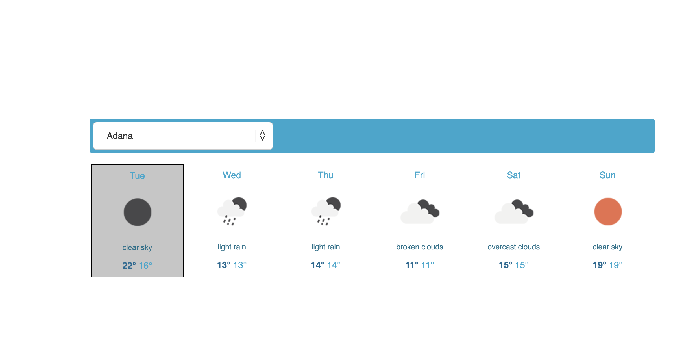

# Weather App

This is a simple weather app that shows the weather forecast for the next 5 days in a selected city.

## Features

- Select a city from a dropdown list
- Display weather information for the selected city
- Show loading indicator while fetching weather data
- Show error message if there's a problem fetching data

## Tech Stack

- React
- Axios
- OpenWeatherMap API

## Getting Started

1. Clone the repository: `git clone https://github.com/your-username/weather-app.git`
2. Navigate to the project directory: `cd weather-app`
3. Install dependencies: `npm install`
4. Create an `apiKey.js` file to the env folder and add your OpenWeatherMap API key:

   ```bash
   const apiKey = "your-api-key";

    export default apiKey;
   ```

5. Start the development server: `npm start`

## Available Scripts

In the project directory, you can run:

### `npm start`


